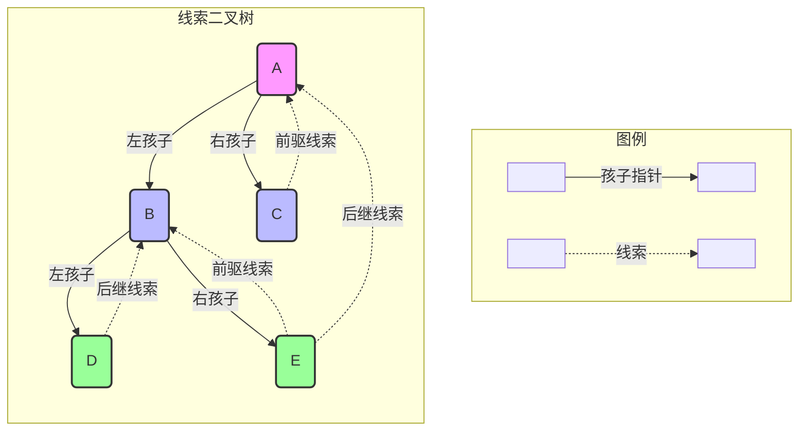

## 一、 核心概念：理解线索二叉树

### 1. 为什么需要线索二叉树？ (The "Why")

在传统的二叉树链式存储中，存在着大量的空闲指针域。

> 对于一个包含 n 个结点的二叉树，其链式结构中共有 2n 个指针域。其中，有 n−1 个指针域被用于链接子节点，因此必然存在 2n−(n−1)=n+1 个空指针域。

为了避免这种空间浪费，并利用这些空指针域来加速查找前驱/后继结点的速度，我们引入了**线索二叉树**。

### 2. 什么是线索二叉树？ (The "What")

- **线索 (Thread)**
    
    > 指向结点在**特定遍历序列**（如中序）中**前驱**或**后继**结点的指针。
    
    - **前驱线索**: 指向前驱结点的指针。
        
    - **后继线索**: 指向后继结点的指针。
        
- **线索化 (Threading)**
    
    > 依据某种遍历次序，将二叉树中所有结点的空指针域改造为线索的过程。
    
- **线索二叉树 (Threaded Binary Tree)**
    
    > 经过“线索化”处理的二叉树。

其中中序遍历的顺序是 `D -> B -> E -> A -> C`
对于 D 而言的后驱线索正是 B
对于 E 而言的前驱是 B，后驱是 A
### 3. 结构定义 (The "How")

为了区分指针的类型（指向孩子还是线索），我们需要在结点定义中增加两个标志位 `leftTag` 和 `rightTag`。

- **结点结构**
    
    ```c
    typedef struct ThreadNode {
        DataType data;                  // 数据域
        struct ThreadNode *leftChild;   // 左指针
        struct ThreadNode *rightChild;  // 右指针
        int leftTag;                    // 左标志位
        int rightTag;                   // 右标志位
    } ThreadBinTreeNode;
    ```
    
- **标志位 `Tag` 的含义**
    
    - `Tag == 0`: 指针指向**孩子**结点。
        
    - `Tag == 1`: 指针为**线索**，指向前驱或后继。
        

## 二、 中序线索二叉树的实现

中序线索二叉树是最为常用的一种，因为它能非常方便地实现非递归遍历和查找操作。

### 1. 中序线索化 (In-order Threading)

#### 算法思想

线索化的过程本质上是在**中序遍历**的过程中，通过一个 `pre` 指针（始终指向刚访问过的结点）来建立结点间的线索关系。

1. **处理前驱**：当中序遍历到某个结点 `cur` 时，若其左孩子为空 (`cur->leftChild == NULL`)，则其左指针可指向其前驱，即 `pre`。
    
2. **处理后继**：若前一个结点 `pre` 的右孩子为空 (`pre->rightChild == NULL`)，则 `pre` 的后继就是当前结点 `cur`。
    
3. **更新指针**：访问完 `cur` 后，将 `pre` 更新为 `cur`，继续遍历。
    

#### 核心算法

```c
// 全局变量，用于记录上一个访问的结点
ThreadBinTreeNode *pre = NULL;

void InThread(ThreadBinTreeNode *root) {
    if (root != NULL) {
        // 1. 递归线索化左子树
        InThread(root->leftChild);

        // 2. 建立当前结点的前驱线索
        if (root->leftChild == NULL) {
            root->leftTag = 1;
            root->leftChild = pre;
        }

        // 3. 建立前驱结点的后继线索
        if (pre != NULL && pre->rightChild == NULL) {
            pre->rightTag = 1;
            pre->rightChild = root;
        }

        // 4. 更新pre指针
        pre = root;

        // 5. 递归线索化右子树
        InThread(root->rightChild);
    }
}
```

### 2. 遍历与查找 (Traversal & Searching)

线索化后，无需使用栈，即可实现高效的非递归遍历。

- **查找中序后继结点**
    
    1. 若 `rightTag == 1`，则 `rightChild` 就是后继。
        
    2. 若 `rightTag == 0`，则后继是其**右子树中序遍历的第一个结点**（即右子树的最左下结点）。
        
- **查找中序前驱结点**
    
    1. 若 `leftTag == 1`，则 `leftChild` 就是前驱。
        
    2. 若 `leftTag == 0`，则前驱是其**左子树中序遍历的最后一个结点**（即左子树的最右下结点）。
        
- **中序遍历算法**
    
    ```c
    void InOrderTraversal(ThreadBinTreeNode *root) {
        if (root == NULL) return;
    
        // 1. 找到遍历的起点（最左下结点）
        ThreadBinTreeNode *cur = root;
        while (cur->leftTag == 0) {
            cur = cur->leftChild;
        }
    
        // 2. 循环访问并查找后继
        while (cur != NULL) {
            // 访问当前结点
            cout << cur->data << " ";
    
            // 查找后继结点
            if (cur->rightTag == 1) {
                cur = cur->rightChild;
            } else {
                cur = cur->rightChild;
                while (cur != NULL && cur->leftTag == 0) {
                    cur = cur->leftChild;
                }
            }
        }
    }
    ```
    

## 三、 总结

- **核心价值**：利用空指针域，加快查找前驱和后继的速度，实现高效的非递归遍历。
    
- **实现关键**：引入 `Tag` 标志位区分指针类型，并在遍历过程中建立线索。
    
- **最常用**：中序线索二叉树，其遍历顺序与查找逻辑最为直观。