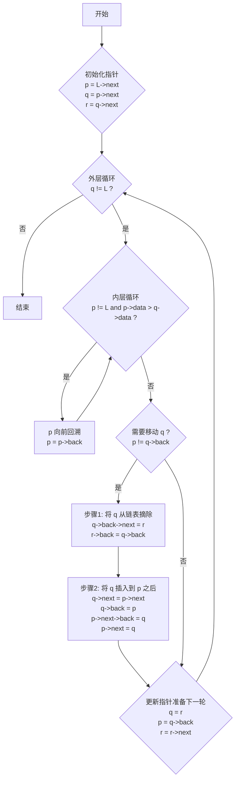

## **一、 循环链表 (Circular Linked List)**

### **1.1 定义与特点**

- **定义**：循环链表是另一种形式的链式存储结构。它的特点是表中最后一个结点的指针域指向头结点，整个链表形成一个环 。
    
- **特点**：
    
    1. 从表中任意一个结点出发，可以遍历到链表中的所有其他结点 。
        
    2. 与普通单链表相比，算法基本一致，但判断链表结束的条件不同 3。单链表判断`p->next == NULL`，而循环链表判断 `p->next == Head`。
        

### **1.2 不同表示方式**

1. **带头结点的循环链表**：
    
    - **非空链表**：最后一个结点的 `next` 指针指向头结点 。
        
    - **空链表**：头结点的 `next` 指针指向自身 。
        
2. **采用尾指针的循环链表**：
    
    - 为了方便操作，有时我们会使用一个尾指针`rear` 指向链表的最后一个结点 。
        
    - **优势**：通过尾指针 `rear`，我们可以在 O(1) 时间复杂度内找到尾结点 (`rear`) 和头结点 (`rear->next`)，这在合并两个链表等操作中非常高效。
        

## **1.3 基本操作**

### **1.3.1 初始化**

创建一个带头结点的空循环链表。其 `next` 指针需要指向自身。
```C
// 假设结点定义如下
typedef struct Node {
    int data;
    struct Node *next;
} Node, *LinkList;

// 初始化一个带头结点的循环链表 
void InitClinkList(LinkList *CL) {
    *CL = (LinkList)malloc(sizeof(Node)); // 分配头结点空间 
    if (!*CL) exit(OVERFLOW);
    (*CL)->next = *CL; // 头结点的next指针指向自身，形成空循环链表 
}
```

> **注意**：与单链表初始化 (`(*L)->next = NULL;`) 的关键区别在于，循环链表的头结点指针需要指向自身 。

### **1.3.2 创建**

通过尾插法创建一个带头结点的循环链表。
```C
// 尾插法建立循环链表，以输入'$'结束 
void CreateCLinkList(LinkList CL) {
    Node *rear, *s;
    char c;
    rear = CL; // rear指针始终指向当前链表的最后一个结点 
    c = getchar(); 
    while(c != '$') { 
        s = (Node *)malloc(sizeof(Node)); 
        s->data = c; 
        rear->next = s; // 将新结点s链接到尾部 
        rear = s; // rear指针移向新的尾结点 
        c = getchar();   
    }
    rear->next = CL; // 循环的关键：将最后一个结点的next指向头结点 
}
```

### **1.3.3 合并两个循环链表**

将两个用**尾指针**表示的循环链表 `RA` 和 `RB` 合并为一个链表。

**思路图解：**

1. 保存 `RA` 的头结点（`RA->next`）。
    
2. 将 `RA` 的尾部连接到 `RB` 的第一个实际结点（`RB->next->next`）。
    
3. 将 `RB` 的尾部连接到之前保存的 `RA` 的头结点。
    

**算法实现 (带头结点):**
```C
// 合并两个由尾指针表示的循环链表 RA 和 RB 
LinkList merge_2(LinkList RA, LinkList RB) {
    Node *p;
    p = RA->next; // p保存RA的头结点 
    RA->next = RB->next->next; // RA的尾结点链接到RB的第一个数据结点 
    free(RB->next); // 释放RB的头结点 
    RB->next = p; // RB的尾结点链接到RA的头结点 
    return RB; // 返回新链表的尾指针 
}
```

---

## **二、 双向链表 (Double Linked List)**

### **2.1 定义与特点**

- **定义**：在单链表的基础上，为每个结点增加一个指向其**前驱**结点的指针域 `back` 。
    
- **特点**：
    
    - 每个结点包含`back`、`data`、`next` 三个域 。
        
    - 结构对称，可以方便地找到前驱和后继结点 。
        
    - 对于任意非头尾结点`p`，恒有 `p == p->back->next == p->next->back` 。
        
    - **优点**：可以方便地进行前后双向遍历和查找，删除和插入操作比单链表更高效（因为可以直接找到前驱结点，无需从头遍历）。
        
    - **缺点**：每个结点需要额外的指针空间，空间开销更大。
        

### **2.2 结点结构**
```C
// 双向链表结点结构定义 
struct DblNode {
    ElemType   data;   // 数据域 
    DblNode    *back;  // 指向前驱的指针 
    DblNode    *next;  // 指向后继的指针 
};
```

## **2.3 基本操作**

### **2.3.1 插入结点**

在 `nextPtr` 结点前插入一个新的 `newPtr` 结点。

操作步骤：

需要修改四个指针的指向。正确的顺序至关重要，以防丢失链表信息。

一个正确的顺序是：

1. `newPtr->back = nextPtr->back;` (新结点的 `back` 指向 `nextPtr` 的前驱)
    
2. `newPtr->next = nextPtr;` (新结点的 `next` 指向 `nextPtr`)
    
3. `nextPtr->back->next = newPtr;` (`nextPtr` 前驱的 `next` 指向新结点)
    
4. `nextPtr->back = newPtr;` (`nextPtr` 的 `back` 指向新结点)
    

**代码片段：**
```C
// 假设 p 指向要在其后插入新结点 s 的位置
s->next = p->next;
p->next->back = s;
s->back = p;
p->next = s;
```

### **2.3.2 删除结点**

从链表中删除 `tmpPtr` 指向的结点。

操作步骤：

仅需修改两个指针，将被删除结点的前驱和后继直接连接起来。

1. `tmpPtr->back->next = tmpPtr->next;` (让 `tmpPtr` 的前驱结点的 `next` 指向 `tmpPtr` 的后继) 13
    
2. `tmpPtr->next->back = tmpPtr->back;` (让 `tmpPtr` 的后继结点的 `back` 指向 `tmpPtr` 的前驱) 14
    
3. `free(tmpPtr);` (释放被删除结点的空间)
    

---

## **三、 链表的应用（算法设计题）**

### **3.1 单循环链表改造为双向循环链表**

**问题**：一个单循环链表的结点有 `back`, `data`, `next` 三个域，`back` 域初始为 `NULL`。设计算法将其改为双向循环链表 。

**思路**：遍历整个单循环链表，对于当前结点 `p`，它的后继结点是 `p->next`。我们只需要将后继结点的 `back` 指针指向当前结点 `p` 即可。
```C
// 算法实现 
void StoDouble(SimpleLinkList la) {
    node *p;
    p = la; // p从头结点开始 
    // 循环条件改为 p->next != la，因为p最终会回到头结点la
    while (p->next != la) {
        p->next->back = p; // 核心：后一个结点的back指向当前结点 
        p = p->next; // p后移 
    }
    // 别忘了处理最后一个结点和头结点的链接
    // 对于最后一个结点p，它的next是la，所以la的back应该指向p
    la->back = p;
}
```

### **3.2 一元稀疏多项式求导**

**问题**：一个降幂排列的一元稀疏多项式存储在单循环链表中，头结点 `exp` 域为-1。求它的一阶导数 。

**求导规则**：对于一项 ccdotxe，其导数为 (ccdote)cdotxe−1。

1. 新系数 = 原系数 * 原指数 。
    
2. 新指数 = 原指数 - 1 。
    
3. 如果原指数为0（常数项），求导后为0，应从链表中删除该结点 。
    

**算法实现**：
```C
// ha是带头结点的单循环链表 
void derivative(SimpleCircLinkList &ha) {
    Node<ElemType> *q, *pa;
    q = ha;          // q 指向 pa 的前驱 
    pa = ha->next;   // pa 指向当前处理的结点 

    while (pa != ha) { // 遍历直到回到头结点 
        if (pa->exp == 0) { // 常数项，求导后为0，删除该结点 
            q->next = pa->next; 
            delete pa; 
            pa = q->next; 
        } else {
            pa->coef *= pa->exp; // 计算新系数 
            pa->exp--;           // 计算新指数 
            q = pa;              // 前驱指针后移 
            pa = pa->next;       // 工作指针后移 
        }
    }
}
```

### **3.3 双向循环链表排序**

**问题**：分析给定的算法 `unknown` 的功能 。

**算法分析**：该算法的功能是**对带头结点的双向循环链表进行插入排序**，使其结点按 `data` 域的值从小到大排列 。

**代码（已填空）与注释**：
```C
// 对双向循环链表进行插入排序 
void unknown(BNODETP &L) {
    // ... p, q, r 初始化 ...
    p = L->next; q = p->next; r = q->next; 

    while (q != L) { // 外层循环，q是待插入的元素 
        
        // 内层循环，p从q的前一个位置开始向前寻找插入点
        while (p != L && p->data > q->data) { 
            p = p->back; 
        }

        // 如果q已经在正确的位置(p的后面)，则不需要移动
        if (p != q->back) {
            // 1. 将q从链表中摘出来
            q->back->next = r; 
            r->back = q->back; 

            // 2. 将q插入到p的后面
            q->next = p->next; 
            q->back = p; 
            p->next->back = q;
            p->next = q; 
        }
        
        // q 指向下一个待排序的元素r
        q = r; 
        p = q->back; 
        r = r->next; 
    }
}
```


### **3.4 带访问频度的Locate操作**

**问题**：在非循环双向链表中，实现 `Locate(L, x)` 函数。找到 `x` 后，其结点的访问频度 `freq` 增1，并将其移动到所有频度小于等于它的结点之前，以实现常用元素靠前的目的 。

**算法分析**：

1. **查找**：从头遍历链表，查找数据域为 `x` 的结点 `p` 。如果不存在，返回`NULL` 。
    
2. **更新频度**：如果找到，`p->freq` 加 1 。
    
3. **重新定位**：
    
    - 将结点`p` 从原位置删除 。
        
    - 从`p` 的原前驱位置开始，向前遍历，找到第一个 `freq` 大于或等于 `p->freq` 的结点 `q` 。
        
    - 将`p` 插入到 `q` 之后 。
        

**算法实现**：
```C
// Locate 函数实现 
DLinkNode *Locate(DLinkNode &L, ElemType &x) {
    DLinkNode *p = L->next, *q;
    // 1. 查找值为x的结点p
    while (p != NULL && p->data != x) p = p->next; 
    
    // 2. 如果未找到或链表为空
    if (p == NULL) { 
        cout << "x不存在！"; return NULL; 
    } else {
    // 3. 找到结点p
        p->freq++; // 频度+1 
        
        // 4. 将p从原位置摘除（如果p不是最后一个结点）
        if (p->next != NULL) {
            p->next->back = p->back;
        }
        p->back->next = p->next; 

        // 5. 从p的原前驱q开始，向前寻找插入位置
        q = p->back; 
        while (q != L && q->freq < p->freq) { 
            q = q->back; 
        }

        // 6. 将p插入到q之后
        p->next = q->next; 
        if (q->next != NULL) {
            q->next->back = p; 
        }
        p->back = q; 
        q->next = p; 

        return p; 
    }
}
```
